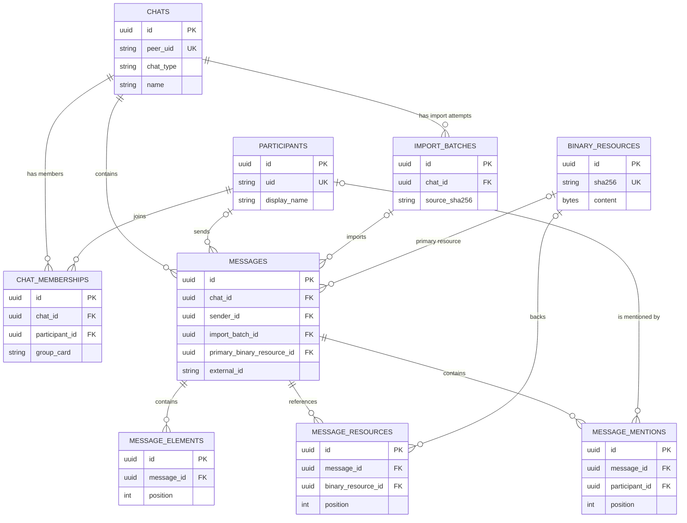

# QQStalker 数据库结构说明

本文以 [`src/models/chat.py`](../src/models/chat.py) 中当前 SQLModel 实体定义为准，说明 PostgreSQL 中的表、字段、约束及关联关系。应用目前通过 `SQLModel.metadata.create_all()` 创建表；本文描述的是模型语义，不替代数据库迁移或实际数据库的 `\d` 输出。

## 设计概览

数据库将 QQChatExporter / NapCat 导出的原始记录规范化为以下几类数据：

- **导入溯源**：`import_batches` 记录每一个导出文件修订的导入尝试。
- **会话和身份**：`chats` 表示群聊或其他会话；`participants` 表示跨会话的 QQ 用户；`chat_memberships` 保存用户在具体群中的群名片和出现范围。
- **消息主体**：`messages` 保存每条消息的可查询字段，同时保留原始内容 JSON。
- **富消息明细**：`message_elements`、`message_resources` 和 `message_mentions` 分别保存有序消息元素、附件引用和 @ 提及。
- **二进制去重存储**：`binary_resources` 用 SHA-256 去重保存本地附件字节，供多条消息资源引用。

## E-R 图



图中 `o|` 表示关联端可为空。特别地，`messages.sender_id`、`messages.import_batch_id`、`messages.primary_binary_resource_id`、`message_resources.binary_resource_id` 与 `message_mentions.participant_id` 都允许为 `NULL`。

## 关系说明

| 关系 | 基数 | 实现 | 含义 |
| --- | --- | --- | --- |
| Chat - ImportBatch | 1 对多 | `import_batches.chat_id` | 一个会话可有多次导入；批次可在未成功识别会话时暂不关联会话。 |
| Chat - Participant | 多对多 | `chat_memberships` | 同一用户可出现在多个群；同一群有多个成员。群名片属于该关系，而不属于全局用户。 |
| Chat - Message | 1 对多 | `messages.chat_id` | 每条消息必须属于一个会话。 |
| Participant - Message | 1 对多（发送端可空） | `messages.sender_id` | 正常消息由一个已识别参与者发送；系统消息或无法识别的发送者可为空。 |
| ImportBatch - Message | 1 对多（批次端可空） | `messages.import_batch_id` | 用于追溯消息从哪个导出文件写入。当前 `ImportBatch` 没有声明反向 ORM 属性，但外键存在。 |
| Message - MessageElement | 1 对多 | `message_elements.message_id` | 一条消息由零至多个保序的富文本元素组成。 |
| Message - MessageResource | 1 对多 | `message_resources.message_id` | 一条消息可引用多个图片、音视频或其他资源。 |
| Message - MessageMention | 1 对多 | `message_mentions.message_id` | 一条消息可含多个 @ 提及。 |
| BinaryResource - MessageResource | 1 对多（引用端可空） | `message_resources.binary_resource_id` | 同一份二进制内容可被多个消息资源复用；无本地文件的资源只保存引用元数据。 |
| BinaryResource - Message | 1 对多（消息端可空） | `messages.primary_binary_resource_id` | 便捷指向该消息的主资源；导入时通常设置为遇到的第一张图片，并不取代资源明细表。 |
| Participant - MessageMention | 1 对多（提及目标可空） | `message_mentions.participant_id` | 已能解析的 @ 目标关联全局参与者；否则仍保留 `mentioned_uid` 和显示名。当前未声明该外键的 ORM `Relationship`。 |

## 表与字段

### `import_batches`：导入批次

每行表示一个导出 JSON 文件修订的一次不可变导入记录。通过路径和文件 SHA-256 的组合，避免将同一修订重复作为新批次处理。

| 字段 | 类型 / 约束 | 含义 |
| --- | --- | --- |
| `id` | UUID，主键 | 批次内部唯一标识；默认生成 UUID。 |
| `chat_id` | UUID，可空，外键 `chats.id`，索引 | 此批次对应的会话。 |
| `source_path` | 字符串，索引 | 导入时看到的源 JSON 路径。 |
| `source_sha256` | 字符串，最大 64，索引 | 源 JSON 的 SHA-256 校验值。 |
| `source_size_bytes` | 整数 | 源文件大小，单位字节。 |
| `exporter_name` | 字符串 | 导出工具名称。 |
| `exporter_version` | 字符串 | 导出工具版本。 |
| `started_at` | 时间戳，非空 | 开始导入时间，默认当前 UTC 时间。 |
| `completed_at` | 时间戳，可空 | 成功完成导入的时间；未完成时为空。 |
| `metadata_json` | JSON | 除消息正文外保留的导出元数据。 |

唯一约束：`uq_import_source_revision (source_path, source_sha256)`。

### `chats`：会话 / 群聊

表示导出中的 QQ 群、私聊或其他对端会话。`peer_uid` 是会话的稳定业务标识，应优先于群名用于程序内部定位。

| 字段 | 类型 / 约束 | 含义 |
| --- | --- | --- |
| `id` | UUID，主键 | 会话内部唯一标识。 |
| `peer_uid` | 字符串，唯一、索引 | 导出来源中的对端 / 会话 UID。 |
| `chat_type` | 字符串，索引 | 会话类别，例如群聊或私聊。 |
| `name` | 字符串 | 当前显示的会话名称。 |
| `avatar_url` | 字符串，可空 | 会话头像地址。 |
| `self_uid` | 字符串 | 导出账号的 UID。 |
| `self_uin` | 字符串，可空 | 导出账号的 UIN。 |
| `self_name` | 字符串，可空 | 导出账号显示名称。 |
| `created_at` | 时间戳，非空 | 记录首次创建时间，默认 UTC。 |
| `updated_at` | 时间戳，非空 | 记录最近更新时间，默认 UTC；是否更新由导入逻辑负责。 |

唯一约束：`peer_uid`。关联：一对多关联导入批次、群成员关系和消息。

### `participants`：全局参与者

表示在任意已导入会话中出现为发送者或被提及者的 QQ 用户。全局用户资料与群内名片分开保存。

| 字段 | 类型 / 约束 | 含义 |
| --- | --- | --- |
| `id` | UUID，主键 | 参与者内部唯一标识。 |
| `uid` | 字符串，唯一、索引 | QQ 用户 UID，是跨群去重的业务键。 |
| `uin` | 字符串，可空、索引 | QQ UIN；可能未提供。 |
| `display_name` | 字符串 | 导出记录中的全局显示名称。 |
| `nickname` | 字符串，可空 | 昵称。 |
| `created_at` | 时间戳，非空 | 首次出现时的创建时间，默认 UTC。 |
| `updated_at` | 时间戳，非空 | 资料最近更新时间，默认 UTC。 |

唯一约束：`uid`。关联：通过 `chat_memberships` 参加会话；可作为 `messages.sender_id` 的发送者。

### `chat_memberships`：群成员关系

这是 `chats` 与 `participants` 的连接表，并存放只有在某个群中才有意义的数据。

| 字段 | 类型 / 约束 | 含义 |
| --- | --- | --- |
| `id` | UUID，主键 | 关系记录内部唯一标识。 |
| `chat_id` | UUID，非空，外键 `chats.id`，索引 | 所属会话。 |
| `participant_id` | UUID，非空，外键 `participants.id`，索引 | 对应参与者。 |
| `group_card` | 字符串，可空 | 用户在此群使用的群名片。 |
| `first_seen_at` | 时间戳，可空 | 在该会话记录中最早出现的时间。 |
| `last_seen_at` | 时间戳，可空 | 在该会话记录中最近出现的时间。 |

唯一约束：`uq_chat_membership (chat_id, participant_id)`，保证同一用户在同一会话只有一条成员关系。

### `messages`：消息主体

保存消息检索、排序和导出的核心字段，同时保留完整富内容 JSON。消息实体是其他消息明细表的中心。

| 字段 | 类型 / 约束 | 含义 |
| --- | --- | --- |
| `id` | UUID，主键 | 消息内部唯一标识。 |
| `chat_id` | UUID，非空，外键 `chats.id`，索引 | 消息所属会话。 |
| `sender_id` | UUID，可空，外键 `participants.id`，索引 | 发送者；系统或未知消息可为空。 |
| `import_batch_id` | UUID，可空，外键 `import_batches.id`，索引 | 写入此消息的导入批次。 |
| `primary_binary_resource_id` | UUID，可空，外键 `binary_resources.id`，索引 | 主附件的快捷引用，通常为第一张图片。 |
| `external_id` | 字符串 | 导出来源中的消息 ID。 |
| `sequence` | 字符串，可空 | 来源消息序列号；与时间、主键共同用于稳定排序。 |
| `message_type` | 字符串，索引 | 来源消息类别。 |
| `sent_at` | 时间戳，索引 | 来源记录的发送时间。 |
| `source_timestamp_ms` | 64 位整数，非空、索引 | 来源 Unix 时间戳，单位毫秒，适合按时间范围查询。 |
| `text` | 字符串，默认空 | 可读的纯文本内容。 |
| `html` | 字符串，默认空 | 来源提供的 HTML 内容。 |
| `recalled` | 布尔值，默认 `false` | 是否已撤回。 |
| `system` | 布尔值，默认 `false` | 是否系统消息。 |
| `raw_content_json` | JSON | 原始内容对象，作为未完全规范化字段的保真副本。 |
| `created_at` | 时间戳，非空 | 入库记录创建时间，默认 UTC。 |

唯一约束：`uq_chat_message (chat_id, external_id)`。这使重叠范围的重复导入可以按同一会话内的来源消息 ID 跳过。

### `message_elements`：有序富消息元素

将一条消息的元素序列拆开保存，例如文本、回复、表情或尚未专门建模的元素类型。具体负载保留在 JSON 中。

| 字段 | 类型 / 约束 | 含义 |
| --- | --- | --- |
| `id` | UUID，主键 | 元素记录内部唯一标识。 |
| `message_id` | UUID，非空，外键 `messages.id`，索引 | 所属消息。 |
| `position` | 整数 | 在来源消息元素数组中的从零开始顺序。 |
| `element_type` | 字符串，索引 | 元素类型。 |
| `data_json` | JSON | 元素原始数据。 |

唯一约束：`uq_message_element_position (message_id, position)`，保证每条消息中每个位置最多一项。

### `binary_resources`：去重的二进制资源

保存已定位到本地文件的附件字节。不同消息即使引用同一文件，也只需存储一份内容。

| 字段 | 类型 / 约束 | 含义 |
| --- | --- | --- |
| `id` | UUID，主键 | 二进制资源内部唯一标识。 |
| `sha256` | 字符串，最大 64，唯一、索引 | 文件内容 SHA-256，用于跨消息去重。 |
| `resource_type` | 字符串，可空、索引 | 来源资源类型，例如图片。 |
| `original_filename` | 字符串，可空 | 原始文件名。 |
| `mime_type` | 字符串，可空 | 探测或来源提供的 MIME 类型。 |
| `byte_size` | 整数 | 二进制内容大小，单位字节。 |
| `content` | 二进制，大对象，非空 | 实际文件字节。 |
| `created_at` | 时间戳，非空 | 入库时间，默认 UTC。 |

唯一约束：`sha256`。

### `message_resources`：消息附件引用

保存一条消息对某个附件的有序引用。即使附件没有下载到本地，也可以保存来源路径、URL 与元数据。

| 字段 | 类型 / 约束 | 含义 |
| --- | --- | --- |
| `id` | UUID，主键 | 资源引用内部唯一标识。 |
| `message_id` | UUID，非空，外键 `messages.id`，索引 | 所属消息。 |
| `binary_resource_id` | UUID，可空，外键 `binary_resources.id`，索引 | 对应的本地去重二进制资源；缺失本地文件时为空。 |
| `position` | 整数 | 在来源资源数组中的从零开始顺序。 |
| `resource_type` | 字符串，可空、索引 | 资源类型。 |
| `resource_name` | 字符串，可空 | 资源名称。 |
| `resource_path` | 字符串，可空 | 来源声明的路径。 |
| `resource_url` | 字符串，可空 | 来源声明的远程 URL。 |
| `local_path` | 字符串，可空 | 导入时发现的本地文件路径。 |
| `metadata_json` | JSON | 资源原始元数据。 |

唯一约束：`uq_message_resource_position (message_id, position)`。

### `message_mentions`：消息 @ 提及

保存一条消息中所有 @ 提及及其原始顺序。被提及的用户可能不在当前已识别参与者集合中，所以同时保存可查询的来源 UID 和显示名。

| 字段 | 类型 / 约束 | 含义 |
| --- | --- | --- |
| `id` | UUID，主键 | 提及记录内部唯一标识。 |
| `message_id` | UUID，非空，外键 `messages.id`，索引 | 所属消息。 |
| `participant_id` | UUID，可空，外键 `participants.id`，索引 | 已解析到的被提及参与者。 |
| `position` | 整数 | 在来源提及数组中的从零开始顺序。 |
| `mentioned_uid` | 字符串，索引 | 来源中的被提及用户 UID。 |
| `display_name` | 字符串 | 来源中的被提及用户显示名。 |
| `mention_type` | 字符串 | 来源中的提及类型。 |

唯一约束：`uq_message_mention_position (message_id, position)`。

## 约束、索引与实现注意点

### 唯一性

| 表 | 唯一键 | 作用 |
| --- | --- | --- |
| `chats` | `peer_uid` | 同一来源会话只保存一份。 |
| `participants` | `uid` | 同一 QQ 用户可跨群复用。 |
| `binary_resources` | `sha256` | 相同文件内容只保存一份二进制。 |
| `import_batches` | `(source_path, source_sha256)` | 同一路径的同一文件修订只作为一个导入批次。 |
| `chat_memberships` | `(chat_id, participant_id)` | 同一用户在同一会话只有一条成员关系。 |
| `messages` | `(chat_id, external_id)` | 同一来源消息不会在同一会话重复导入。 |
| `message_elements` | `(message_id, position)` | 保证元素顺序位置唯一。 |
| `message_resources` | `(message_id, position)` | 保证资源顺序位置唯一。 |
| `message_mentions` | `(message_id, position)` | 保证提及顺序位置唯一。 |

### 查询索引

模型显式为常用定位字段建立索引，包括所有主要外键、`messages.message_type`、`messages.sent_at`、`messages.source_timestamp_ms`、`participants.uid` / `uin`、`chats.peer_uid`、`binary_resources.sha256` 与 `message_mentions.mentioned_uid`。其中消息导出按群和时间范围筛选时，最直接相关的是 `messages.chat_id` 和 `messages.source_timestamp_ms`。

### 空值与删除行为

- 代码没有在模型上声明 `ondelete` 级联策略。因此删除父记录时的实际行为应以数据库创建出的外键默认行为为准，不能假定会自动级联清理子记录。
- 可空外键用于保留不完整来源数据：例如未解析的发送者、没有本地附件的资源、未知的 @ 目标，仍可以入库。
- `primary_binary_resource_id` 是加速展示的冗余引用；资源的完整、权威明细应读取 `message_resources`。

## 数据流示例

导入一条带图片并 @ 某成员的群消息时，通常会发生如下写入：

```text
1. 找到或创建 chats / participants / chat_memberships
2. 创建 import_batches（若该导出修订尚未导入）
3. 创建 messages，关联 chat、sender 和 import batch
4. 为每个富消息片段创建 message_elements
5. 为每个 @ 创建 message_mentions，并尽可能关联 participant
6. 为每个附件创建 message_resources
7. 若存在本地附件文件，按 SHA-256 找到或创建 binary_resources，
   再将 message_resources.binary_resource_id 指向它
8. 第一张图片还会写入 messages.primary_binary_resource_id，方便预览
```

这套设计使“完整保真”（JSON 与二进制）、“结构化查询”（消息、成员、时间、提及）和“增量导入”（外部 ID 与哈希去重）可以并存。
